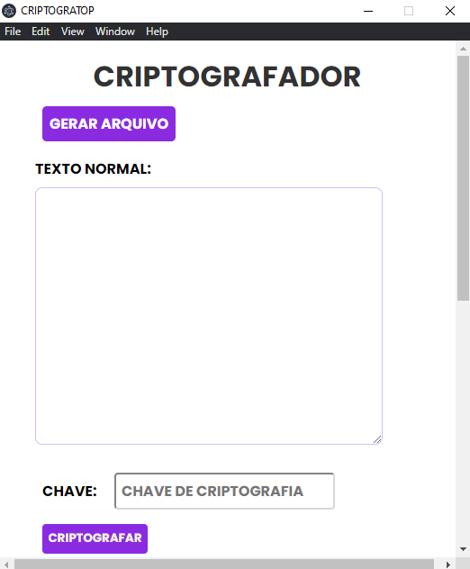
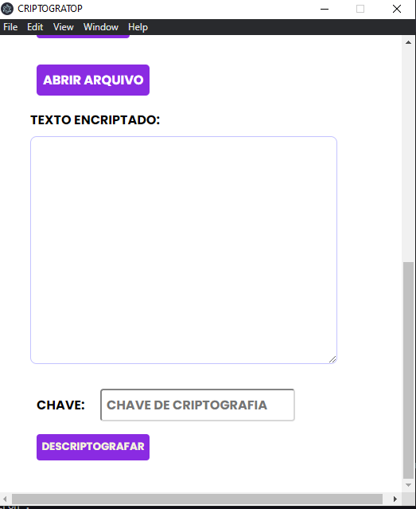
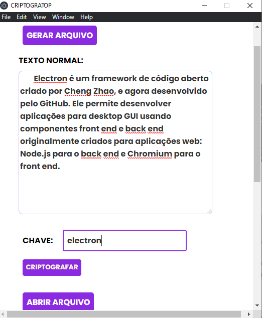
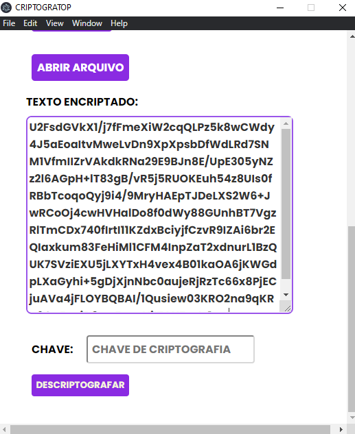

# CRYPTOP
aplicação desktop que serve para criptografar textos a partir de chaves ...

|tela 01 |tela 02  | tela 03 |tela 04  |
|--|--|--|--|
| |  |  | |

## **Inicialização**

    npm install
  **ou** 
  
    yarn install
### **depois**

    yarn dev
   **ou**
   
    npm dev
